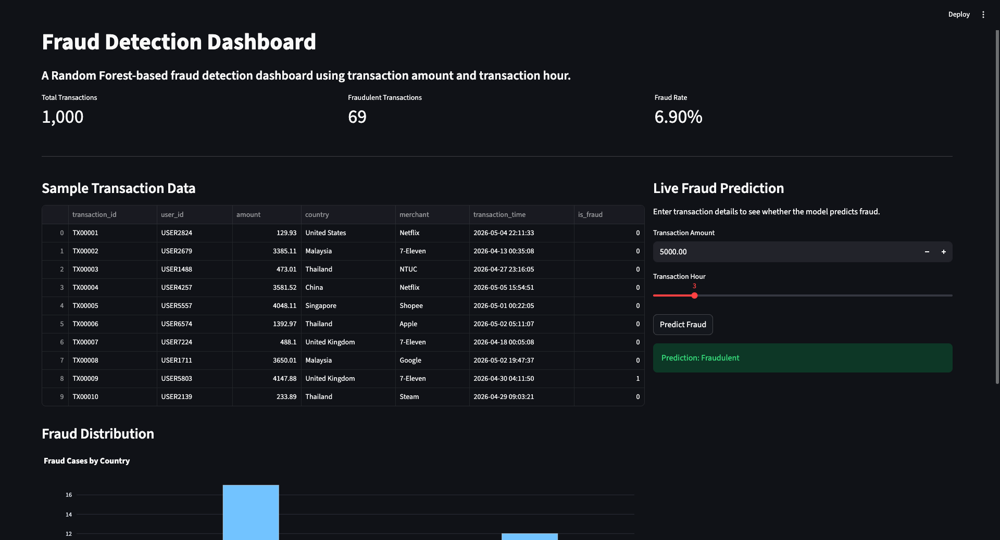

# Fraud Detection Dashboard

## Project Overview

This project is a machine learning-based fraud detection system built with Python and Streamlit. It uses a **Random Forest classifier** trained on transaction amount and time features to predict fraudulent transactions in real-time.

The system combines:

- Machine Learning (Random Forest algorithm)
- Data Analysis and visualisation
- Interactive web dashboard for fraud monitoring
- Real-time prediction capabilities

Key features:

- Analyzss transaction patterns using amount and hour of transaction
- Classifies transactions as fraudulent or legitimate
- Provides visual insights on fraud distribution by country
- Offers live prediction interface for new transactions

This project demonstrates how financial institutions can leverage machine learning to automate fraud detection and reduce operational risk.

---

# Business Problem

Financial fraud is a significant threat to institutions and customers. Manual fraud detection is:

- **Time-consuming**: Impossible to review millions of transactions manually
- **Inefficient**: Rule-based systems miss sophisticated fraud patterns
- **Reactive**: Fraud is detected after losses occur
- **Resource-intensive**: Requires large teams to monitor activity

**Solution**: This project demonstrates how machine learning can automatically detect fraud by analysing transaction patterns. Specifically, fraudsters often:

- Make unusually high or low value transactions
- Conduct transactions at unusual hours (e.g., overnight)

By training a Random Forest model on transaction amount and time, we can predict fraudulent activity **in real-time** before transactions are processed.

---

# Objectives

The objectives of this project are to:

- Train a Random Forest model on historical transaction data
- Use transaction amount and time as predictive features
- Achieve accurate fraud classification with high precision and recall
- Enable real-time fraud detection via an interactive dashboard
- Visualise fraud trends and patterns by geography and time
- Provide stakeholders with actionable fraud insights

---

# Dataset

The dataset used in this project is a synthetic transaction dataset generated using Python.

The dataset contains:

| Column           | Description                         |
| ---------------- | ----------------------------------- |
| transaction_id   | Unique transaction identifier       |
| user_id          | Customer identifier                 |
| amount           | Transaction amount                  |
| country          | Country of transaction              |
| merchant         | Merchant name                       |
| transaction_time | Timestamp of transaction            |
| is_fraud         | Fraud label (0 = normal, 1 = fraud) |

Fraud patterns were simulated using:

- high transaction amounts
- overseas transactions
- unusual transaction timing
- random anomaly injection

---

# Technologies Used

## Programming Language

- Python

## Libraries

- Pandas
- NumPy
- Matplotlib
- Plotly
- Scikit-learn
- Streamlit

## Tools

- Jupyter Notebook
- Git
- GitHub

---

# Project Structure

```text
fraud-detection-project/
│
├── data/
│   └── fraud_transactions_dataset.csv
│
├── notebooks/
│   └── eda.ipynb
│
├── app/
│   ├── dashboard.py
│
├── models/
│   └── fraud_detection_model.pkl
│
├── screenshots/
│   ├── Fraudulent_Predictions.png
│   └── Legitimate_Predictions.png
│
├── requirements.txt
├── README.md
└── .gitignore
```

---

# Installation

## Prerequisites

- Python 3.8+
- pip (Python package manager)

## Setup Steps

1. **Clone the repository**

```bash
git clone https://github.com/yourusername/fraud-detection-dashboard.git
cd fraud-detection-dashboard
```

2. **Create a virtual environment**

```bash
python -m venv venv
source venv/bin/activate  # On Windows: venv\Scripts\activate
```

3. **Install dependencies**

```bash
pip install -r requirement.txt
```

---

# Usage

## Running the Dashboard

```bash
streamlit run app/dashboard.py
```

The dashboard will open in your browser at `http://localhost:8501`

## Features

- **Transaction Overview**: View key metrics including total transactions and fraud count
- **Fraud Analytics**: Interactive chart showing fraud distribution by country
- **Live Prediction**: Enter transaction details to get real-time fraud predictions
  - Transaction Amount
  - Transaction Hour (0-23)
  - Overseas Transaction (Yes/No)

---

# Architecture Diagram

```
┌─────────────────────────────────────────────────────┐
│                  User Interface                      │
│           (Streamlit Dashboard)                      │
└─────────────────────┬───────────────────────────────┘
                      │
        ┌─────────────┼─────────────┐
        │             │             │
        ▼             ▼             ▼
    ┌────────┐  ┌──────────┐  ┌──────────┐
    │  Data  │  │Prediction│  │Analytics │
    │ Module │  │  Module  │  │  Module  │
    └────────┘  └──────────┘  └──────────┘
        │             │             │
        └─────────────┼─────────────┘
                      │
        ┌─────────────┴─────────────┐
        │                           │
        ▼                           ▼
    ┌─────────────────┐      ┌──────────────┐
    │ transactions.csv│      │ ML Model     │
    │ (Raw Data)      │      │ (RandomForest)
    └─────────────────┘      └──────────────┘
```

---

# Screenshots

### Live Prediction Form


_Interactive form for real-time fraud detection predictions_

---

# Model Details

## Algorithm

- **Model Type**: Random Forest Classifier
- **Features**: Transaction amount, transaction hour
- **Target**: Binary classification (Fraud/Non-Fraud)

## Performance Metrics

The model is evaluated using:

- Precision: Accuracy of positive predictions
- Recall: Coverage of actual fraud cases
- F1-Score: Harmonic mean of precision and recall
- Accuracy: Overall correctness

---

# Future Enhancements

- [ ] Real-time data streaming
- [ ] Advanced feature engineering
- [ ] Model improvement and retraining
- [ ] User authentication
- [ ] Database integration
- [ ] API endpoints for predictions
- [ ] Explainability features (SHAP, LIME)

---

# Author

Created as a demonstration project for fraud detection using machine learning.
